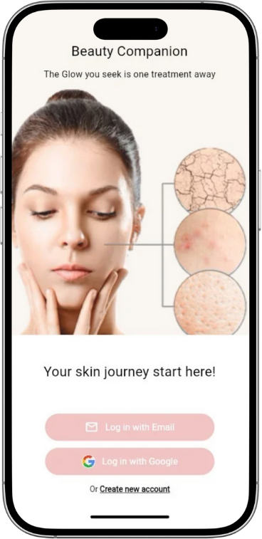
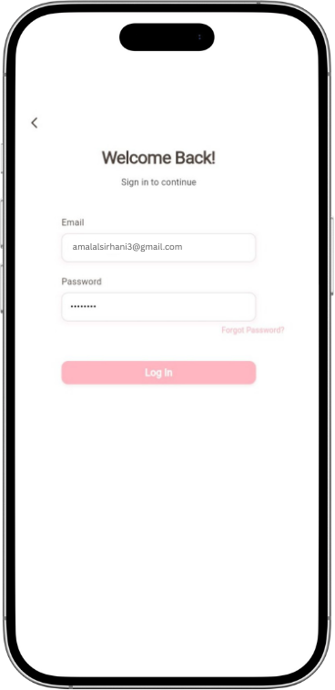
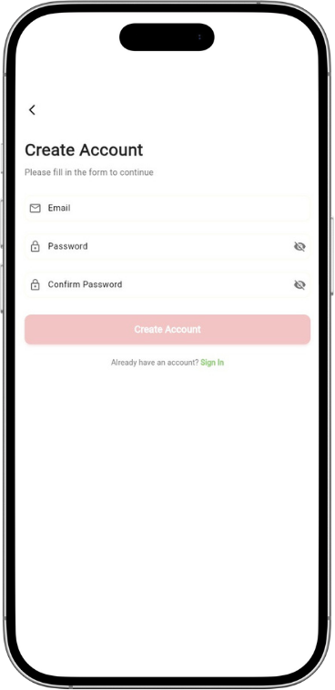
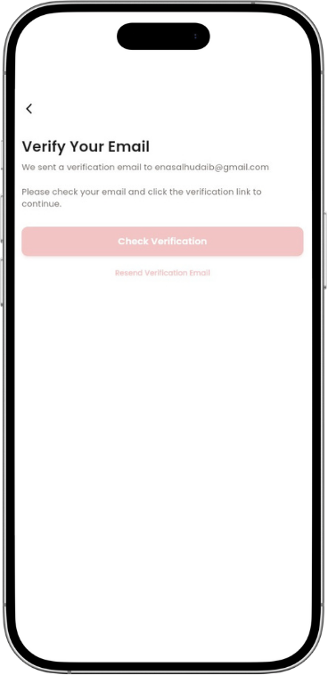
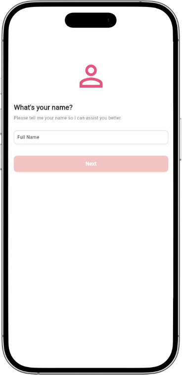
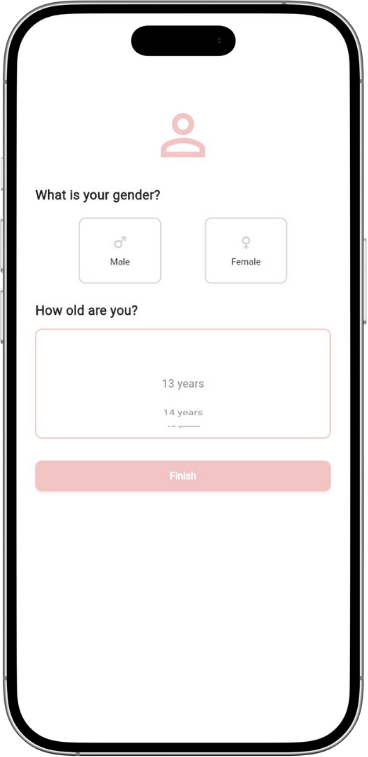
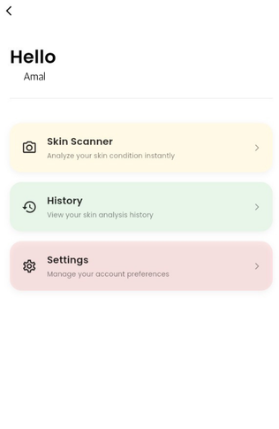
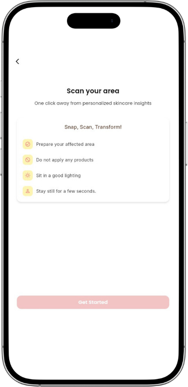
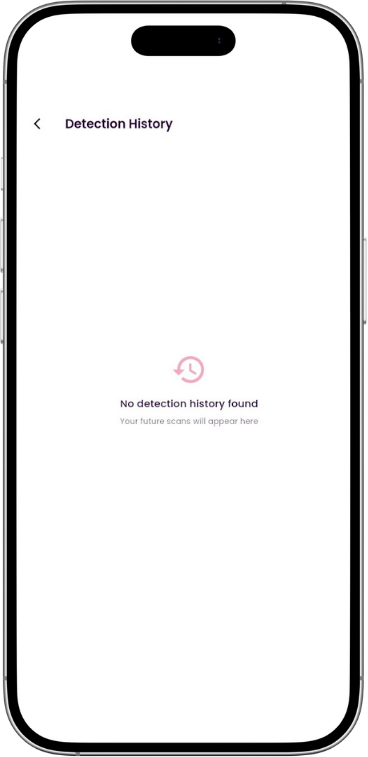
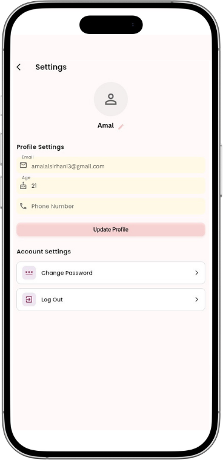

# Smart-Care-App

AI-powered mobile application for skin disease detection and personalized skincare recommendations using **Flutter**, **Firebase**, and **TensorFlow**.

---

## 📖 Overview
The **Smart Care App** is an AI-powered mobile application that helps users detect skin diseases and receive personalized skincare recommendations.  
It uses **Flutter** for cross-platform development, **Firebase** for backend services, and **TensorFlow** for the AI model.

---

## 🎯 Features
- 🔍 Skin disease detection using Convolutional Neural Networks (CNN).  
- 📷 Real-time image analysis with the smartphone camera.  
- 💡 Personalized skincare routines and product suggestions.  
- 📝 History tracking for monitoring skin improvements.  
- 🔐 Secure user authentication and data storage.  

---

## 🛠️ Technologies Used
- **Frontend:** Flutter (Dart)  
- **Backend & Cloud:** Firebase (Authentication, Firestore, Cloud Storage)  
- **Machine Learning:** TensorFlow / Keras  
- **Design:** Figma  
- **IDE:** Android Studio  

---

## 📱 Screenshots

### 🔐 Authentication
  
  
  
  
  

### 👤 User Profile Setup
  
  

### 📲 Main App
  
  
  
  



Open the project in Android Studio or VS Code.

Install dependencies:

bash
Copy code
flutter pub get
Run the app:

bash
Copy code
flutter run
👩‍💻 Team Members

Amal Alsirhani

Enas Naif Alhudaib

Danah Mohammed Alrwaili

Abeer Mohammed Alruwaili


Supervisor: Dr. Abdulaziz Ibrahim Shehab


---

## 🚀 How to Run
1. Clone this repository:
   ```bash
   git clone https://github.com/AmalAlsr/Smart-Care-App.git


📜 License
This project is licensed under the MIT License – see the  file for det
