# Smart-Care-App

AI-powered mobile application for skin disease detection and personalized skincare recommendations using **Flutter**, **Firebase**, and **TensorFlow**.

---

## 📖 Overview
The **Smart Care App** is an AI-powered mobile application that helps users detect skin diseases and receive personalized skincare recommendations.  
It uses **Flutter** for cross-platform development, **Firebase** for backend services, and **TensorFlow** for the AI model.

---

## 🎯 Features
- 🔍 Skin disease detection using Convolutional Neural Networks (CNN).  
- 📷 Real-time image analysis with the smartphone camera.  
- 💡 Personalized skincare routines and product suggestions.  
- 📝 History tracking for monitoring skin improvements.  
- 🔐 Secure user authentication and data storage.  

---

## 🛠️ Technologies Used
- **Frontend:** Flutter (Dart)  
- **Backend & Cloud:** Firebase (Authentication, Firestore, Cloud Storage)  
- **Machine Learning:** TensorFlow / Keras  
- **Design:** Figma  
- **IDE:** Android Studio  

---

## 📱 Screenshots

### 🔐 Authentication
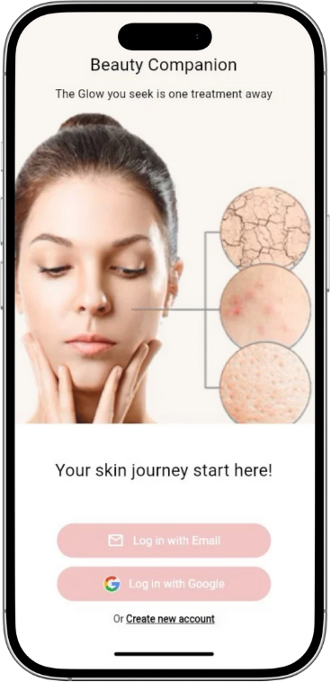  
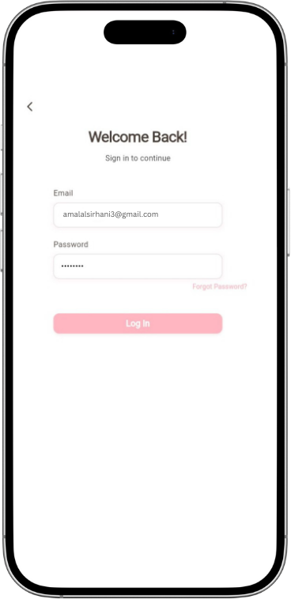  
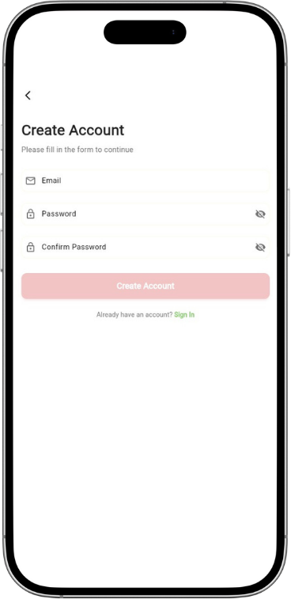  
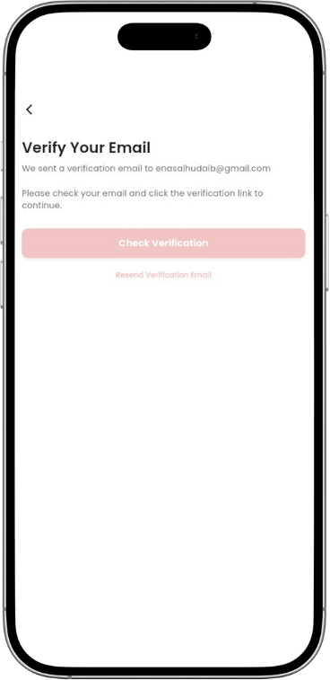  
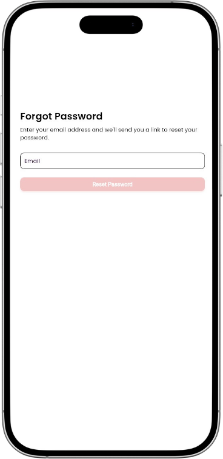

### 👤 User Profile Setup
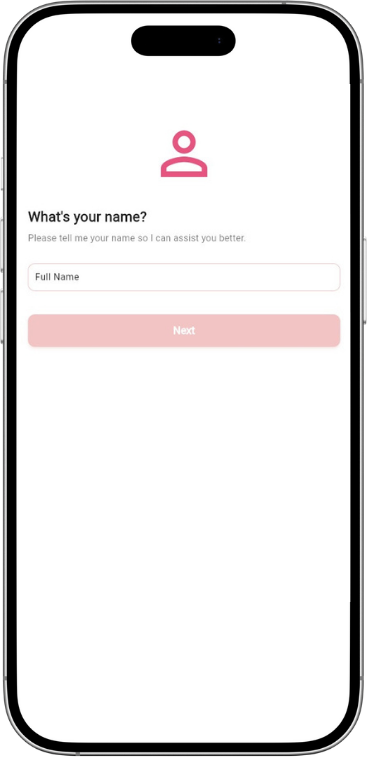  
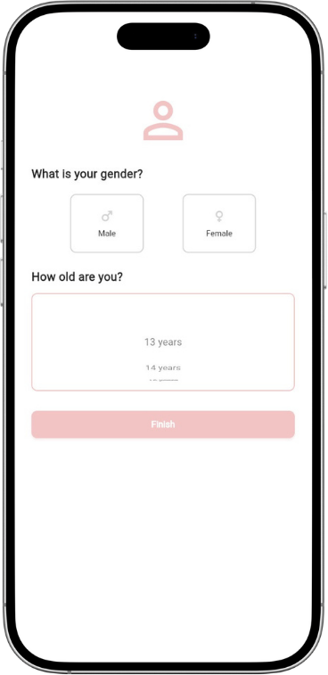  

### 📲 Main App
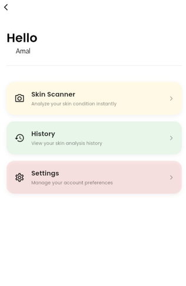  
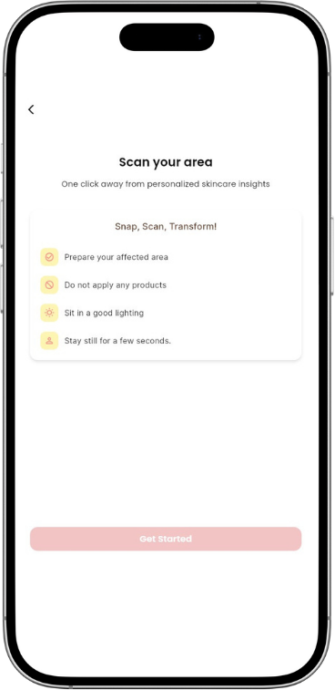  
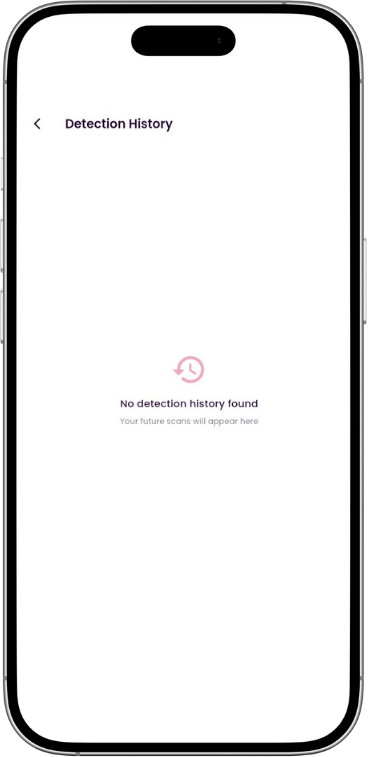  
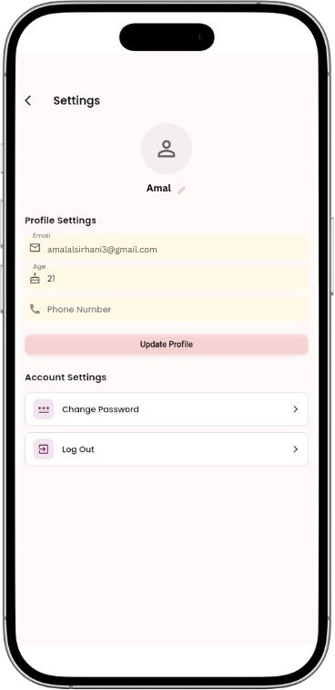  

---

## 🚀 How to Run
1. Clone this repository:
   ```bash
   git clone https://github.com/AmalAlsr/Smart-Care-App.git
2 Open the project in Android Studio or VS Code.

3 Install dependencies:

flutter pub get

Run the app:

flutter run 


### 👩‍💻 Team Members
---
Amal Abdullah Alsirhani

Enas Naif Alhudaib

Danah Mohammed Alrwaili

Abeer Mohammed Alruwaili

Supervisor: Dr. Abdulaziz Ibrahim Shehab

### 📜 License
---
This project is licensed under the MIT License – see the LICENSE
 file for details.
